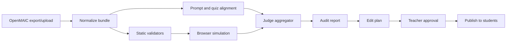

# OpenMAIC Courseware Audit Design

## Goal

Calculus Quest should focus on one primary job: audit OpenMAIC-generated courseware, help teachers fix release-blocking issues, then publish verified courseware to students. Adaptive coaching, analytics, and authoring prototypes are useful only when they support that flow.

## Feature Triage

### Core

- Student player: keep. It already loads OpenMAIC `index.json`, scenes, quizzes, audio, and interactive HTML. It should become the runtime for approved courseware only.
- Courseware audit: add as the main new system. It checks uploaded/exported OpenMAIC bundles before release.
- Quiz grading and review: keep. Add audit checks for answer keys, rubric, concept coverage, answer leakage, and short-answer grading status.
- Admin review: keep but reshape around import, audit, edit plan, approval, and publish.
- Minimal learning records: keep progress and quiz data so teachers can confirm released courseware works for students.

### Simplify

- Agentic path planning: keep optional after quiz, but do not make it part of audit pass/fail.
- Research analytics: demote behind audit operations. Keep completion, quiz errors, broken interactions, short-answer status, and audit history.
- Knowledge graph: keep for concept-chain checks, quiz coverage, and scene metadata validation.
- `openmaic-authoring-loop`: migrate reusable judge/edit-plan ideas into `lib/course-audit`; avoid running it as a second product.

### Defer Or Remove

- Broad skip/relearn/extend route experiments and research evidence exports.
- Root-level one-off scripts unless promoted into `ops/` for import/audit/publish.
- Full teacher authoring UI in this repo. OpenMAIC remains the authoring tool; this project audits and serves outputs.
- EduInteract as a required dependency. Keep it as an optional visual-solution adapter.

## Recommended Architecture

Use Progressive Audit: static checks first, browser runtime checks second, then a judge aggregator merges evidence into a release decision.

## Audit Modules

- `lib/course-audit/adapters`: read local `resources/open-maic/*`, uploaded JSON/zip, and later OpenMAIC API responses.
- `lib/course-audit/validators`: deterministic schema, asset, metadata, quiz, and knowledge-chain checks.
- `lib/course-audit/browser`: Playwright/Chrome runner that opens the student player, clicks scenes, operates interactions, submits quizzes, and records console/network/screenshot evidence.
- `lib/course-audit/judges`: optional LLM judges for concept accuracy, prompt alignment, quiz quality, and visual-text consistency.
- `lib/course-audit/edit-plan`: converts issues into reversible patch proposals.
- `lib/course-audit/eduinteract`: optional visual worked-solution adapter.

## Pass/Fail Policy

- `critical`: blocks publication. Examples: broken JSON, missing scene resource, quiz answer missing, answer visible before submit, interactive scene fails to load.
- `warning`: publishable only with teacher approval. Examples: weak distractor rationale, missing optional metadata, uneven difficulty.
- `info`: non-blocking improvement.

LLM judgments cannot override deterministic or browser failures. The final report must show the evidence that caused each issue.

## Current Project Findings

- Existing OpenMAIC resources are substantial: 8 chapters, 120 scenes, 24 quiz scenes, and 72 interactive scenes.
- A1 has scene research metadata, but A2a/A2b/A3/A4/C1/D1/D2 are missing `conceptClusterId`, `representation`, `scenarioType`, and `difficultyBand` on every scene. This should become an audit finding and a safe metadata patch.
- The current quiz flow mostly matches the new goal because it hides answer/rubric before submit and handles short-answer review fallback.
- The current admin dashboard is broader than needed. The Audit tab should become primary; deep learning analytics should be secondary.
- `lib/course-gen/pipeline.js` currently assumes OpenMAIC API paths and response shapes. Future use should go through an adapter.

## OpenMAIC API Contract Checked

I inspected upstream `THU-MAIC/OpenMAIC` route files on 2026-07-03 and will not hardcode beyond these adapter-level fields.

- `POST /api/generate-classroom`: request includes required `requirement`; optional `pdfContent`, `enableWebSearch`, `webSearchProviderId`, `webSearchApiKey`, `baiduSubSources`, `enableImageGeneration`, `enableVideoGeneration`, `enableTTS`, and `agentMode`. Response includes `jobId`, `status`, `step`, `message`, `pollUrl`, and `pollIntervalMs`.
- `GET /api/generate-classroom/{jobId}`: response includes `jobId`, `status`, `step`, `progress`, `message`, `scenesGenerated`, `totalScenes`, `result`, `error`, and `done`.
- `POST /api/classroom`: request requires `stage` and `scenes`; response includes `id` and `url`.
- `GET /api/classroom?id={id}`: response includes `classroom`.
- `POST /api/quiz-grade`: request requires `question`, `userAnswer`, and positive `points`; optional `commentPrompt` and `language`; response includes `score` and `comment`.

## Configuration Needed Later

- `OPENMAIC_BASE_URL`: local or hosted OpenMAIC URL.
- `OPENMAIC_ACCESS_CODE` or another auth mechanism if your OpenMAIC instance is protected.
- `OPENMAIC_ENABLE_WEB_SEARCH`, `OPENMAIC_ENABLE_IMAGE_GENERATION`, `OPENMAIC_ENABLE_VIDEO_GENERATION`, `OPENMAIC_ENABLE_TTS` defaults.
- `AUDIT_MODEL` and `VISION_JUDGE_MODEL` for audit judges.
- `COURSEWARE_UPLOAD_DIR` for imported bundles.
- `EDUINTERACT_ENABLED` and `EDUINTERACT_ROOT` only if visual worked solutions are enabled.
- Playwright browser binaries for runtime audit.

## First Implementation Slice

1. Audit existing local OpenMAIC chapters without live API coupling.
2. Add static validators and `audit-report.json` output.
3. Add browser smoke audit against the current student player.
4. Add admin Audit tab with issue list and publish status.
5. Add publish gating so students see only approved bundles.
6. Add edit-plan drafts for metadata and quiz fixes.

Live OpenMAIC API import/generation should come after the local audit path is stable.

## Open Questions

- Which OpenMAIC instance should we target first: local, hosted, or both?
- Does that instance require access code, cookie auth, or a custom header?
- Should the first student release support one published course or multiple courseware bundles?
- Should EduInteract visual solutions be part of slice one or slice two?
